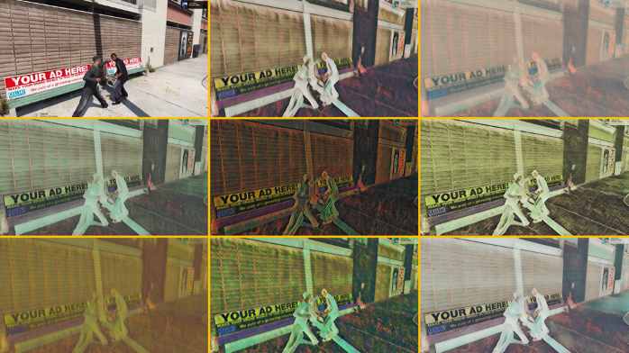

# Data augmentation

Data augmentation is applied on the sequences of frames to regularize the data and to prevent overfitting in the model. Two different data augmentation techniques have been applied to the data: a mix of seven traditional augmentation techniques and style augmentation. After applying the data augmentation technique, the frames are immediately saved in numpy files. The 3D CNN model expects numpy files as input value.

The file **ViolenceDetectionUsingGTAV/Data_preprocessing/Data_augmentation/DataAugmentation.ipynb** contains the code for the data augmentation. Both data augmentation techniques are performed in this file.

### Traditional data augmentation
The Keras ImageDataGenerator was applied for the mix of seven traditional data augmentation techniques. The traditional augmentation techniques consist of horizontal flipping, rotations, zooming, erasing, shearing, conversion to grayscale and random perturbations of hue, saturation, brightness and contrast. The preprocessing parameters are randomly chosen and are shown in the table 1 below.

| Rotation_range  | Horizontal_flipping   |Zoom_range |Shear_range  |Height_shift_range |Width_shift_range  |Fill_mode  |
| --------------- | --------------------- |-----------|------------ |------------------ |----------------   |---------  |
| 40              | True                  | 0.2        | 0.2        | 0.2               | 0.2               |Nearest    |

**Table 1:** Parameters traditional data augmentation

### Style augmentation
Style augmentation is a new form of data augmentation based on a random style transformer. Style augmentation randomizes texture, contrast and color, while preserving the shape and se- mantic content. The code of the style augmentation technique is baded on [Jackson's](https://www.semanticscholar.org/paper/Style-Augmentation%3A-Data-Augmentation-via-Style-Jackson-Abarghouei/a34b1a2cb44cbf647fb64dc9de4c128834bd4cef) research. A number of examples to which style augmentation was applied to a random frame of the GTA-V Fight dataset are shown in figure 1.

**Figure 1:** Style augmentation applied to a frame of the GTA-V Fight dataset. The original frame is shown on the top left.
